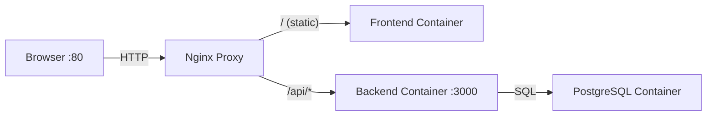
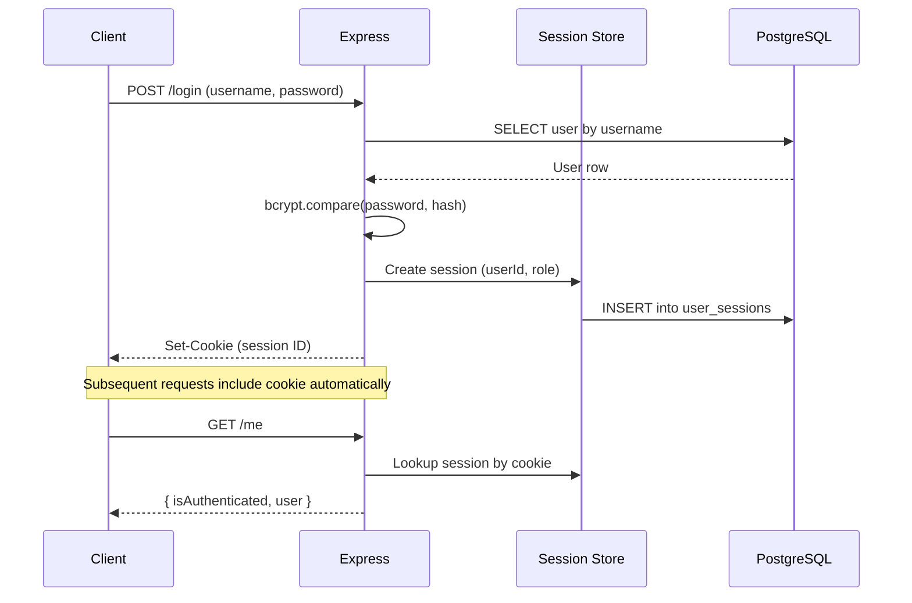
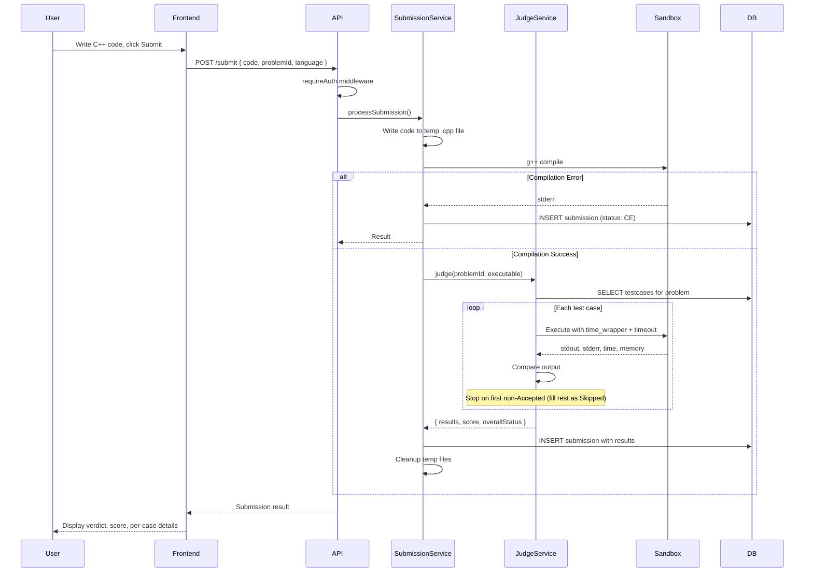
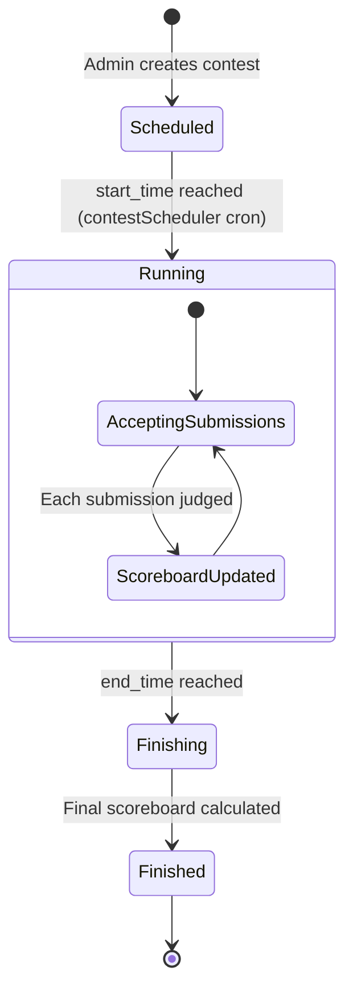
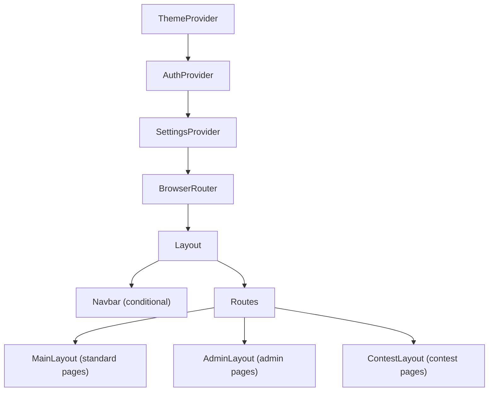

# Architecture — OJ Grader System

> The physical and logical map of the system.

## Tech Stack

| Layer | Technology | Version |
|---|---|---|
| Frontend | React (CRA) | 19.1 |
| Routing | react-router-dom | 7.8 |
| HTTP Client | Axios | 1.11 |
| Code Editor | react-simple-code-editor | 0.14 |
| Syntax Highlight | highlight.js | 11.11 |
| Backend | Express | 5.1 |
| Database | PostgreSQL (Alpine) | 16 |
| Session Store | connect-pg-simple | 9.0 |
| Auth (passwords) | bcrypt | 6.0 |
| Validation | zod | 4.x |
| File Upload | multer | 2.0 |
| ZIP Processing | unzipper | 0.12 |
| Scheduling | node-cron | 3.0 |
| Reverse Proxy | Nginx | 1.25 |
| Containerization | Docker + Compose | — |
| Testing (BE) | Jest 30 + Supertest 7 | — |
| Testing (FE) | Jest + React Testing Library 16 | — |
| Language | TypeScript (backend + frontend) | — |
| Judged Language | C++ (compiled & executed in isolated sandbox) | — |

## System Hierarchy

```
OJ/
├── .context/               # AI context documentation (this directory)
├── .env / .env.example     # Environment configuration
├── docker-compose.yml      # Orchestrates 4 containers
├── nginx-proxy/            # Nginx reverse proxy config
│
├── backend/                # Express API server (TypeScript)
│   ├── server.ts           # App entry point, route mounting, scheduler start
│   ├── db.ts               # PostgreSQL connection pool (pg)
│   ├── config/
│   │   └── env.ts          # Runtime env validation (zod) + typed env export
│   ├── constants/
│   │   └── index.ts        # Centralized constants (roles, statuses, limits)
│   ├── controllers/        # Route handlers (Express Router per domain)
│   │   ├── authController.ts
│   │   ├── adminController.ts
│   │   ├── problemController.ts
│   │   ├── submissionController.ts
│   │   └── contestController.ts
│   ├── services/           # Business logic & external processes
│   │   ├── judgeService.ts       # Compile & judge C++ in sandbox
│   │   ├── submissionService.ts  # Submission processing
│   │   ├── submissionQueryService.ts # Submission read/write query orchestration
│   │   ├── adminQueryService.ts  # Admin user/settings/database query orchestration
│   │   ├── adminSystemService.ts # Admin database import/export command construction
│   │   ├── problemQueryService.ts # Problem CRUD/upload/export query orchestration
│   │   ├── batchUploadService.ts # Bulk problem import from ZIP
│   │   ├── problemMigration.ts   # Problem data migration
│   │   ├── contestQueryService.ts # Contest list/detail/scoreboard query orchestration
│   │   └── contestScheduler.ts   # Cron-based contest lifecycle
│   ├── middleware/
│   │   ├── auth.ts         # requireAuth, requireStaffOrAdmin, requireAdmin
│   │   ├── requestContext.ts # Maps session into typed req.user
│   │   ├── validation.ts   # zod runtime request validation middleware
│   │   ├── errorHandler.ts # asyncHandler + AppError + global error middleware
│   │   └── upload.ts       # Multer configuration
│   ├── schemas/
│   │   └── requestSchemas.ts # Shared z.object request schemas (all controllers)
│   ├── utils/
│   │   └── errorMessage.ts # Shared unknown->message error normalization helper
│   ├── scripts/
│   │   ├── init_db.ts      # Schema creation (DROP CASCADE + CREATE)
│   │   ├── create_admin.ts # Interactive admin user setup
│   │   ├── clear_submissions.ts
│   │   └── time_wrapper.c  # C wrapper for microsecond execution timing
│   ├── types/              # Type definitions and interfaces
│   │   ├── api.ts          # Request/response DTO contracts
│   │   ├── models.ts       # DB row interfaces + shared DTO aliases
│   │   ├── service.ts      # Shared service-layer interfaces/result unions
│   │   ├── env.d.ts        # ProcessEnv declaration merging
│   │   └── express/        # Express Request declaration merging (req.user)
│   └── tests/              # Jest + Supertest API and Unit tests (TypeScript)
│       ├── setup.ts        # Test environment setup
│       ├── db.test.ts      # DB pool connection tests
│       ├── authController.test.ts, ... # Controller tests
│       ├── services/       # Mock-heavy unit tests for business logic
│       │   ├── judgeService.test.ts
│       │   ├── submissionService.test.ts
│       │   ├── batchUploadService.test.ts
│       │   ├── problemMigration.test.ts
│       │   └── contestScheduler.test.ts
│       └── middleware/     # Tests for auth and upload middlewares
│           ├── auth.test.ts
│           └── upload.test.ts
│
├── frontend/               # React SPA (Create React App)
│   └── src/
│       ├── App.tsx         # Root component, routing, provider tree
│       ├── index.tsx       # ReactDOM entry
│       ├── index.css       # Global styles & CSS variables
│       ├── config/
│       │   └── constants.ts      # Polling intervals, UI timeouts
│       ├── context/              # React Context providers
│       │   ├── AuthContext.tsx   # User auth state + login/logout
│       │   ├── ThemeContext.tsx  # Light/dark theme toggle
│       │   └── SettingsContext.tsx # System settings (registration)
│       ├── services/             # API abstraction layer (Axios)
│       │   ├── api.ts            # Axios instance (base URL, credentials)
│       │   ├── authService.ts
│       │   ├── adminService.ts
│       │   ├── admin/            # usersAdminService, problemsAdminService, ...
│       │   ├── problemService.ts
│       │   ├── submissionService.ts
│       │   ├── contestService.ts
│       │   └── scoreboardService.ts
│       ├── hooks/                # Custom React hooks (page logic)
│       │   ├── useContests.ts, useContestDetail.ts, ...
│       │   ├── useProblems.ts, useProblemDetail.ts, ...
│       │   ├── useSubmissions.ts, useSubmissionModal.ts, ...
│       │   ├── useCodeSubmission.ts, useScoreboard.ts, ...
│       │   ├── useAuthForms.ts, useAutocomplete.ts, ...
│       │   ├── useHomeQuotes.ts, useAdminPage.ts
│       │   └── admin/            # Admin-specific hooks
│       ├── pages/                # Route-level page components
│       │   ├── home/       ├── auth/        ├── problem/
│       │   ├── contest/    ├── submission/  ├── scoreboard/
│       │   └── admin/
│       ├── features/             # Feature modules (complex UI + logic)
│       │   ├── admin/            # UserManagement, ProblemManagement,
│       │   │                     # ContestManagement, Settings
│       │   ├── auth/       ├── contest/
│       │   ├── problem/    └── scoreboard/
│       ├── components/           # Shared/reusable UI components
│       │   ├── navbar/
│       │   ├── shared/           # LoadingPage, ErrorBanner, etc.
│       │   └── styles/           # Shared CSS modules
│       ├── layouts/              # Layout wrappers
│       │   ├── admin/            # AdminLayout (sidebar + content)
│       │   └── contest/          # ContestLayout (contest navbar + content)
│       ├── utils/
│       │   ├── constants.ts      # App-wide constants
│       │   ├── error.ts          # Unknown/API-like error normalization helper
│       │   └── formatters.ts     # Date, status, result formatting utilities
│       └── tests/                # Jest + RTL tests
│
└── tests/
    └── run_tests.sh        # Unified test runner (BE then FE)
```

## Frontend Quality Gates

- Main CI validation command: `npm run validate`
  - `npm run type-check`
  - `npm run lint:check`
  - `npm run test:ci`
- Progressive frontend test typing commands:
  - `npm run type-check:tests:services`
  - `npm run type-check:tests:hooks`
  - `npm run type-check:tests:all`

## Logical Flows

### Request Routing (Infrastructure)



Nginx strips the `/api` prefix before forwarding to the backend. The frontend is a static React build served by its own Nginx instance inside the container.

Backend runtime request pipeline (high-level):
1. `express-session` resolves session state from `user_sessions`.
2. `attachRequestUser` maps session into typed `req.user`.
3. Route-level middleware validates payload (`zod` via shared schemas + `validateRequest`).
4. Controllers call services for DB-heavy logic.
5. Errors propagate via `asyncHandler` to centralized `errorHandler`.

### Authentication Flow



### Submission & Judging Flow



### Contest Lifecycle



Key behaviors:
- **`contestScheduler.ts`** runs a cron job that checks contest times and transitions statuses automatically.
- When a contest is **running**, its problems are snapshotted into `contest_problems` (immutable copy) and become inaccessible as standalone problems.
- Submissions during a contest go to `contest_submissions` (separate from global `submissions`).
- The `contest_scoreboards` table tracks per-user scores with `last_score_improvement_time` for tiebreaking.

### Provider Tree (Frontend)



The `Layout` component conditionally hides the main `Navbar` when the user is inside contest or admin routes (they have their own navigation).
