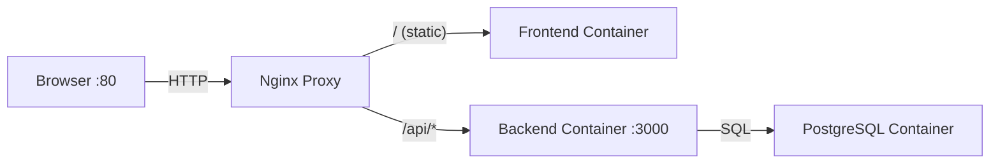
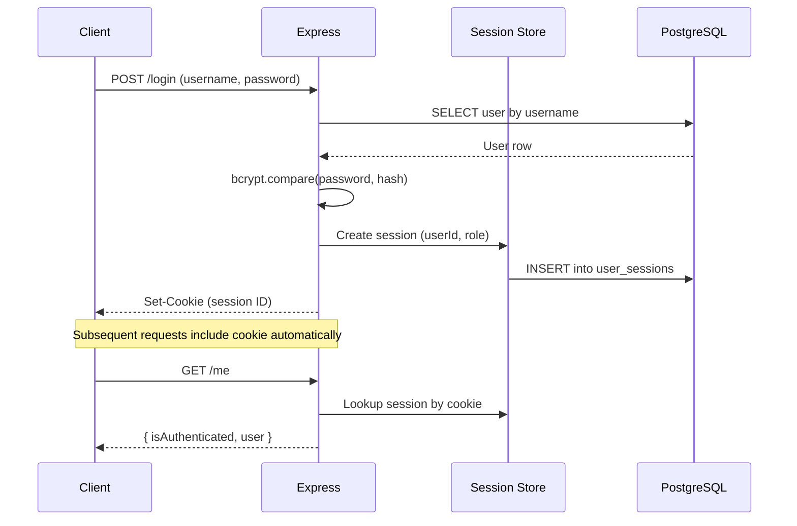
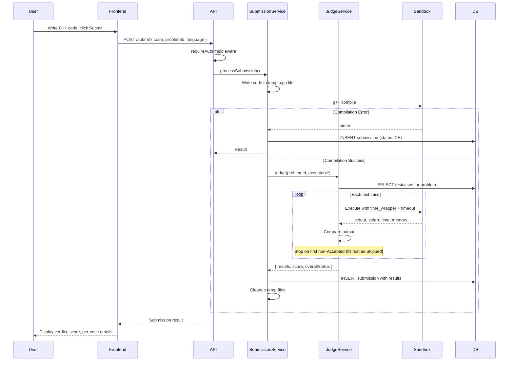
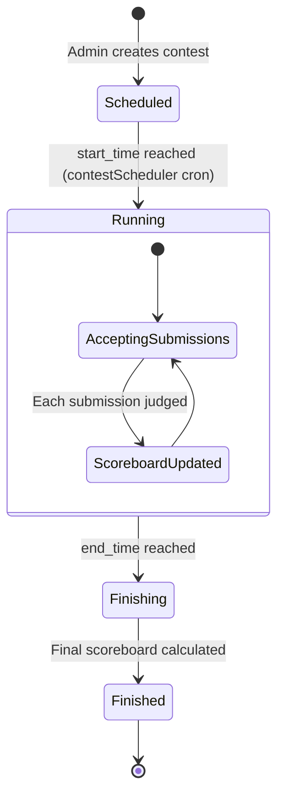
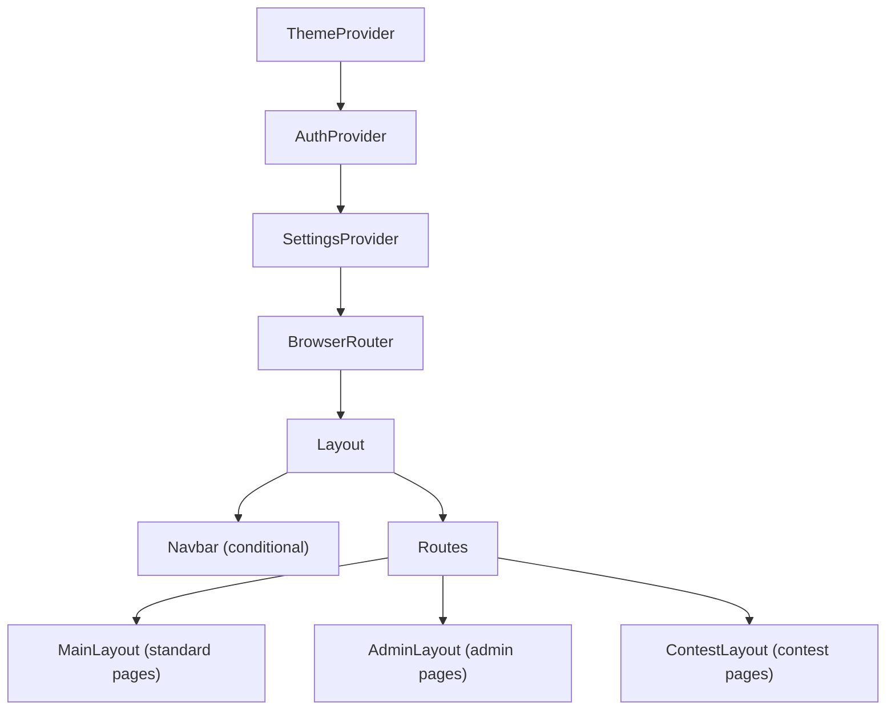

# Architecture — OJ Grader System

> The physical and logical map of the system.

## Tech Stack

| Layer | Technology | Version |
|---|---|---|
| Frontend | React (CRA) | 19.1 |
| Routing | react-router-dom | 7.8 |
| HTTP Client | Axios | 1.11 |
| Code Editor | react-simple-code-editor | 0.14 |
| Syntax Highlight | highlight.js | 11.11 |
| Backend | Express | 5.1 |
| Database | PostgreSQL (Alpine) | 16 |
| Session Store | connect-pg-simple | 9.0 |
| Auth (passwords) | bcrypt | 6.0 |
| Validation | express-validator | 7.1 |
| File Upload | multer | 2.0 |
| ZIP Processing | unzipper | 0.12 |
| Scheduling | node-cron | 3.0 |
| Reverse Proxy | Nginx | 1.25 |
| Containerization | Docker + Compose | — |
| Testing (BE) | Jest 30 + Supertest 7 | — |
| Testing (FE) | Jest + React Testing Library 16 | — |
| Language | JavaScript (CommonJS backend, ESM frontend) | — |
| Judged Language | C++ (compiled & executed in isolated sandbox) | — |

## System Hierarchy

```
OJ/
├── .context/               # AI context documentation (this directory)
├── .env / .env.example     # Environment configuration
├── docker-compose.yml      # Orchestrates 4 containers
├── nginx-proxy/            # Nginx reverse proxy config
│
├── backend/                # Express API server
│   ├── server.js           # App entry point, route mounting, scheduler start
│   ├── db.js               # PostgreSQL connection pool (pg)
│   ├── constants/
│   │   └── index.js        # Centralized constants (roles, statuses, limits)
│   ├── controllers/        # Route handlers (Express Router per domain)
│   │   ├── authController.js
│   │   ├── adminController.js
│   │   ├── problemController.js
│   │   ├── submissionController.js
│   │   └── contestController.js
│   ├── services/           # Business logic & external processes
│   │   ├── judgeService.js       # Compile & judge C++ in sandbox
│   │   ├── submissionService.js  # Submission processing
│   │   ├── batchUploadService.js # Bulk problem import from ZIP
│   │   ├── problemMigration.js   # Problem data migration
│   │   └── contestScheduler.js   # Cron-based contest lifecycle
│   ├── middleware/
│   │   ├── auth.js         # requireAuth, requireStaffOrAdmin, requireAdmin
│   │   └── upload.js       # Multer configuration
│   ├── scripts/
│   │   ├── init_db.js      # Schema creation (DROP CASCADE + CREATE)
│   │   ├── create_admin.js # Interactive admin user setup
│   │   ├── clear_submissions.js
│   │   └── time_wrapper.c  # C wrapper for microsecond execution timing
│   └── tests/              # Jest + Supertest API and Unit tests
│       ├── db.test.js      # DB pool connection tests
│       ├── authController.test.js, ... # Controller tests
│       ├── services/       # Mock-heavy unit tests for business logic
│       │   ├── judgeService.test.js
│       │   ├── submissionService.test.js
│       │   ├── batchUploadService.test.js
│       │   ├── problemMigration.test.js
│       │   └── contestScheduler.test.js
│       └── middleware/     # Tests for auth and upload middlewares
│           ├── auth.test.js
│           └── upload.test.js
│
├── frontend/               # React SPA (Create React App)
│   └── src/
│       ├── App.js          # Root component, routing, provider tree
│       ├── index.js        # ReactDOM entry
│       ├── index.css       # Global styles & CSS variables
│       ├── config/
│       │   └── constants.js      # Polling intervals, UI timeouts
│       ├── context/              # React Context providers
│       │   ├── AuthContext.js    # User auth state + login/logout
│       │   ├── ThemeContext.js   # Light/dark theme toggle
│       │   └── SettingsContext.js # System settings (registration)
│       ├── services/             # API abstraction layer (Axios)
│       │   ├── api.js            # Axios instance (base URL, credentials)
│       │   ├── authService.js
│       │   ├── adminService.js
│       │   ├── problemService.js
│       │   ├── submissionService.js
│       │   ├── contestService.js
│       │   └── scoreboardService.js
│       ├── hooks/                # Custom React hooks (page logic)
│       │   ├── useContests.js, useContestDetail.js, ...
│       │   ├── useProblems.js, useProblemDetail.js, ...
│       │   ├── useSubmissions.js, useSubmissionModal.js, ...
│       │   ├── useCodeSubmission.js, useScoreboard.js, ...
│       │   ├── useAuthForms.js, useAutocomplete.js, ...
│       │   ├── useHomeQuotes.js, useAdminPage.js
│       │   └── admin/            # Admin-specific hooks
│       ├── pages/                # Route-level page components
│       │   ├── home/       ├── auth/        ├── problem/
│       │   ├── contest/    ├── submission/  ├── scoreboard/
│       │   └── admin/
│       ├── features/             # Feature modules (complex UI + logic)
│       │   ├── admin/            # UserManagement, ProblemManagement,
│       │   │                     # ContestManagement, Settings
│       │   ├── auth/       ├── contest/
│       │   ├── problem/    └── scoreboard/
│       ├── components/           # Shared/reusable UI components
│       │   ├── navbar/
│       │   ├── shared/           # LoadingPage, ErrorBanner, etc.
│       │   └── styles/           # Shared CSS modules
│       ├── layouts/              # Layout wrappers
│       │   ├── admin/            # AdminLayout (sidebar + content)
│       │   └── contest/          # ContestLayout (contest navbar + content)
│       ├── utils/
│       │   ├── constants.js      # App-wide constants
│       │   └── formatters.js     # Date, status, result formatting utilities
│       └── tests/                # Jest + RTL tests
│
└── tests/
    └── run_tests.sh        # Unified test runner (BE then FE)
```

## Logical Flows

### Request Routing (Infrastructure)



Nginx strips the `/api` prefix before forwarding to the backend. The frontend is a static React build served by its own Nginx instance inside the container.

### Authentication Flow



### Submission & Judging Flow



### Contest Lifecycle



Key behaviors:
- **`contestScheduler.js`** runs a cron job that checks contest times and transitions statuses automatically.
- When a contest is **running**, its problems are snapshotted into `contest_problems` (immutable copy) and become inaccessible as standalone problems.
- Submissions during a contest go to `contest_submissions` (separate from global `submissions`).
- The `contest_scoreboards` table tracks per-user scores with `last_score_improvement_time` for tiebreaking.

### Provider Tree (Frontend)



The `Layout` component conditionally hides the main `Navbar` when the user is inside contest or admin routes (they have their own navigation).
