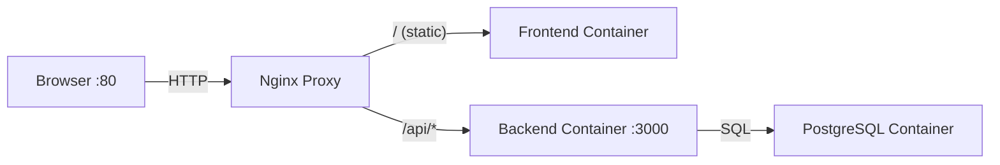
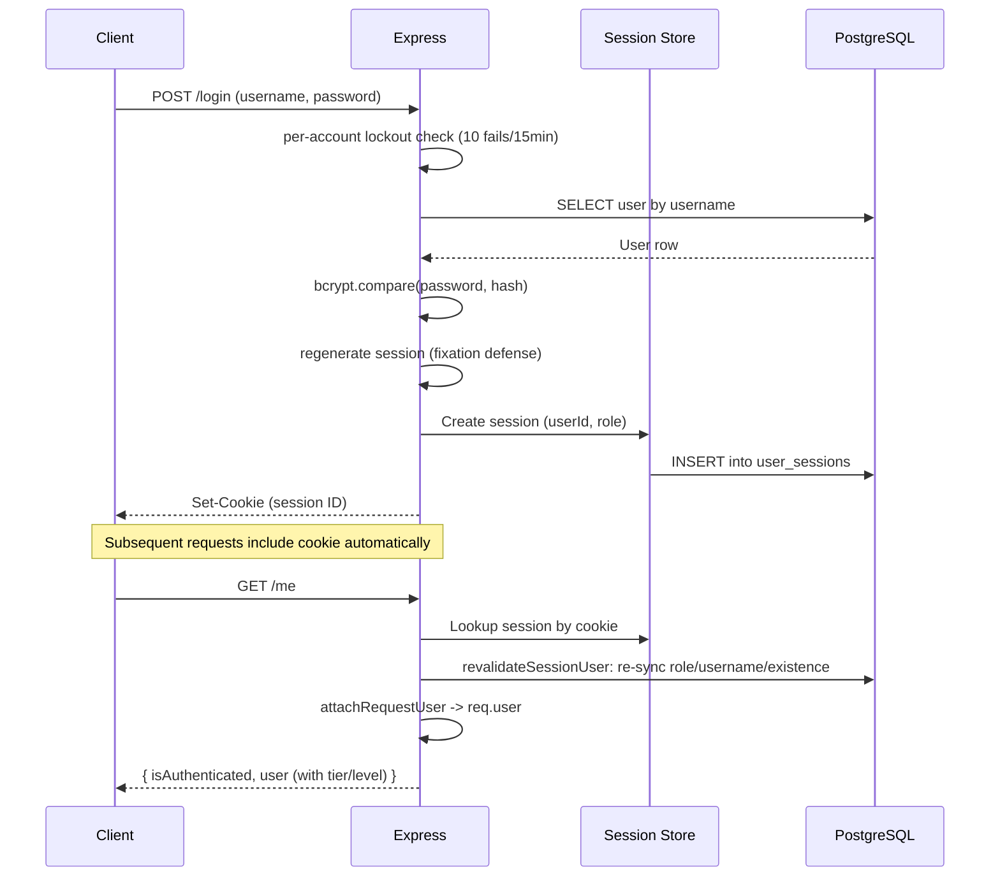
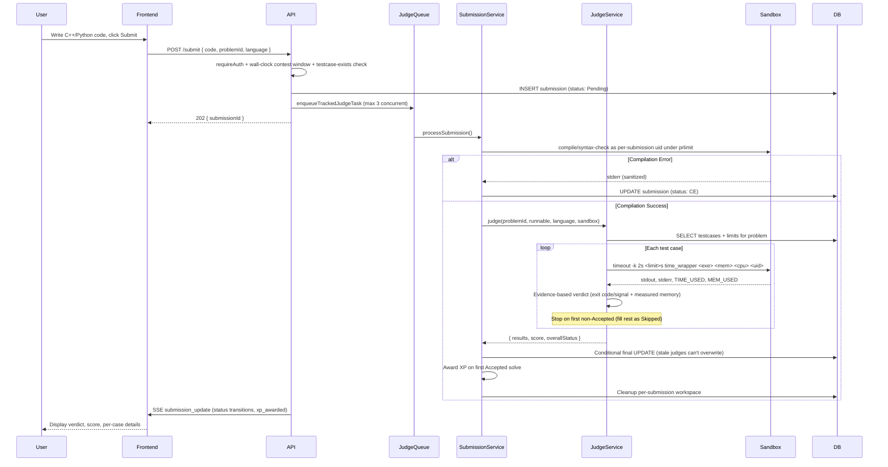
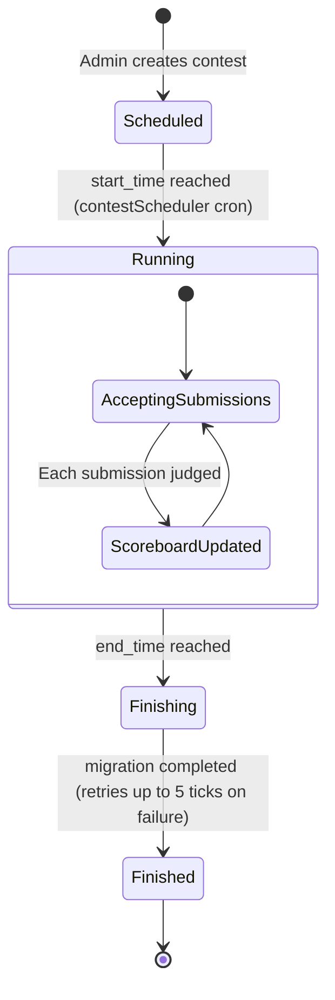
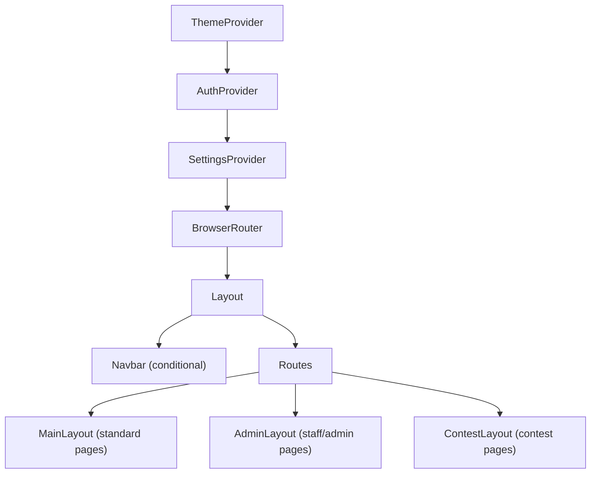

# Architecture — OJ Grader System

> The physical and logical map of the system.

## Tech Stack

| Layer | Technology | Version |
|---|---|---|
| Frontend | React (CRA) | 19.1 |
| Routing | react-router-dom | 7.8 |
| HTTP Client | Axios | 1.11 |
| Charts | recharts | 3.10 |
| Code Editor | react-simple-code-editor | 0.14 |
| Syntax Highlight | highlight.js | 11.11 |
| Backend | Express | 5.1 |
| Database | PostgreSQL (Alpine) | 16 |
| Session Store | connect-pg-simple | 9.0 |
| Rate Limiting | express-rate-limit | 8.5 |
| Auth (passwords) | bcrypt | 6.0 |
| Validation | zod | 4.x |
| File Upload | multer | 2.0 |
| Image Processing | sharp | 0.34 |
| ZIP Processing | unzipper | 0.12 |
| Scheduling | node-cron | 3.0 |
| Reverse Proxy | Nginx | 1.25 |
| Containerization | Docker + Compose | — |
| Testing (BE) | Jest 30 + Supertest 7 | — |
| Testing (FE) | Jest + React Testing Library 16 | — |
| Testing (visual) | Playwright | 1.63 |
| Language | TypeScript (backend + frontend) | — |
| Judged Languages | C++ (compiled) and Python (stdlib-only interpreter), executed in an isolated per-submission sandbox | — |

## System Hierarchy

```
OJ/
├── .context/               # AI context documentation (this directory)
├── .env / .env.example     # Environment configuration
├── docker-compose.yml      # Orchestrates the stack (database, migrate one-shot,
│                           #   backend, authoring-runner, frontend, nginx-proxy)
├── nginx-proxy/            # Nginx reverse proxy config
│
├── backend/                # Express API server (TypeScript)
│   ├── server.ts           # Entry: createApp, startup submission sweep, scheduler start
│   ├── app.ts              # Express app factory: middleware order, router mounting
│   ├── db.ts               # pg Pool (max 20, statement_timeout 60s) + withTransaction
│   ├── config/
│   │   └── env.ts          # Runtime env validation (zod) + typed env export
│   ├── constants/
│   │   ├── index.ts        # Centralized constants (roles, statuses, limits, rate limits)
│   │   └── progression.ts  # XP / level / tier progression constants
│   ├── controllers/        # Route handlers (Express Router per domain)
│   │   ├── authController.ts
│   │   ├── adminController.ts
│   │   ├── problemController.ts
│   │   ├── submissionController.ts
│   │   ├── contestController.ts
│   │   ├── analyticsController.ts      # Admin analysis tab
│   │   ├── healthController.ts
│   │   ├── realtimeController.ts       # SSE submission/scoreboard streams
│   │   ├── userProfileController.ts    # Public profiles, avatars, password change
│   │   ├── authorProfileController.ts  # Author identity API
│   │   └── authoring*.ts               # Draft/job/testcase/workspace authoring API
│   ├── services/           # Business logic & external processes
│   │   ├── judgeService.ts       # Judge C++/Python in per-submission sandbox
│   │   ├── judgeQueue.ts         # Concurrency gate + in-flight registry + contest drain
│   │   ├── submissionService.ts  # Submission pipeline + startup orphan sweep
│   │   ├── submissionQueryService.ts # Submission read/queue/query orchestration
│   │   ├── rejudgeService.ts     # Batch rejudge (problem/contest scope)
│   │   ├── progressionService.ts # XP/level/tier/rank derivation and awarding
│   │   ├── siteSettingsService.ts # system_settings access (access mode, toggles)
│   │   ├── maintenanceMode.ts    # Import-time 503 gate + scheduler pause
│   │   ├── similarityService.ts  # Contest cheat detection
│   │   ├── adminQueryService.ts  # Admin user/settings query orchestration
│   │   ├── adminDatabaseService.ts # Database import/export jobs + progress
│   │   ├── problemQueryService.ts # Problem CRUD/upload/export/testcase-viewer
│   │   ├── collectionQueryService.ts # Collections CRUD + bulk visibility
│   │   ├── batchUploadService.ts # Bulk problem import from ZIP
│   │   ├── problemMigration.ts   # Contest attach/detach + post-contest migration
│   │   ├── contestQueryService.ts # Contest list/detail/join orchestration
│   │   ├── contestScoreboardQueryService.ts # Scoreboard variants by status
│   │   ├── contestParticipantQueryService.ts # Participant-gated problem access
│   │   ├── contestAccess.ts      # Shared contest role/visibility predicates
│   │   ├── contestScheduler.ts   # Cron-based contest lifecycle (retries, drain)
│   │   ├── realtimeHub.ts        # In-process pub/sub for SSE events
│   │   ├── authoring*/ts         # Authoring workspace services (drafts, jobs, publish, ...)
│   │   └── userAvatarImageService.ts / userProfileQueryService.ts
│   ├── middleware/
│   │   ├── auth.ts         # requireAuth, requireStaffOrAdmin, requireAdmin (req.user only)
│   │   ├── requestContext.ts # revalidateSessionUser + attachRequestUser
│   │   ├── rateLimit.ts    # General/auth/submit limiters + login lockout
│   │   ├── siteAccess.ts   # requirePublicAccess (PUBLIC/PRIVATE mode gate)
│   │   ├── validation.ts   # zod runtime request validation middleware
│   │   ├── errorHandler.ts # asyncHandler + AppError + global error middleware
│   │   └── upload.ts       # Multer configuration (2 GiB general, 10 MiB images)
│   ├── schemas/
│   │   └── requestSchemas.ts # Shared z.object request schemas (all controllers)
│   ├── utils/
│   │   ├── sandboxProcess.ts  # Shell-less bounded child runner + sandbox identities
│   │   ├── compileGuard.ts    # Forbidden #include detection (incl. macro includes)
│   │   ├── dbErrors.ts        # isUniqueViolation (Postgres 23505 -> 409)
│   │   ├── csv.ts             # RFC 4180 serialisation + formula-injection guard
│   │   ├── errorMessage.ts    # Unknown->message error normalization helper
│   │   └── logger.ts          # Structured logger (JSON in prod)
│   ├── scripts/
│   │   ├── init_db.ts      # Destructive dev reset (DROP CASCADE + CREATE)
│   │   ├── migrate.ts      # Non-destructive migration runner (advisory lock)
│   │   ├── create_admin.ts # Interactive admin user setup
│   │   ├── backfill_xp.ts  # Backfill user_problem_rewards from history
│   │   ├── seed_xp_tiers.ts # Demo seeder for progression UI review
│   │   ├── verifyHotfix.ts # Sandbox workspace-ownership verification
│   │   ├── clear_submissions.ts
│   │   └── time_wrapper.c  # C wrapper: timing, rlimits, privilege drop, seccomp
│   ├── types/              # Type definitions and interfaces
│   │   ├── api.ts          # Request/response DTO contracts
│   │   ├── models.ts       # DB row interfaces + shared DTO aliases
│   │   ├── service.ts      # Shared service-layer interfaces/result unions
│   │   ├── env.d.ts        # ProcessEnv declaration merging
│   │   └── express/        # Express Request declaration merging (req.user)
│   └── tests/              # Jest + Supertest API and Unit tests (TypeScript)
│       ├── setup.ts        # Test environment setup (global pg mock)
│       ├── authController.test.ts, ... # Controller tests
│       ├── services/       # Mock-heavy unit tests for business logic
│       ├── middleware/     # Middleware tests
│       └── integration/    # Real-PostgreSQL authoring suites
│
├── frontend/               # React SPA (Create React App)
│   └── src/
│       ├── App.tsx         # Root component, routing, provider tree
│       ├── index.tsx       # ReactDOM entry
│       ├── index.css       # Global styles & CSS variables
│       ├── config/
│       │   └── constants.ts      # Polling intervals, realtime/SSE tuning
│       ├── context/              # React Context providers
│       │   ├── AuthContext.tsx   # User auth state + login/logout + refreshUser
│       │   ├── ThemeContext.tsx  # Light/dark theme toggle
│       │   └── SettingsContext.tsx # Site config (access mode, registration,
│       │                          #   password-change toggle) + focus refetch
│       ├── services/             # API abstraction layer (Axios)
│       │   ├── api.ts            # Axios instance + 401 session-expiry interceptor
│       │   ├── authService.ts
│       │   ├── adminService.ts   # Compatibility facade
│       │   ├── admin/            # users/problems/contests/settings/authoring
│       │   ├── problemService.ts
│       │   ├── submissionService.ts
│       │   ├── contestService.ts
│       │   ├── scoreboardService.ts
│       │   ├── userService.ts
│       │   ├── analyticsService.ts
│       │   └── realtimeService.ts # EventSource wrapper (SSE)
│       ├── hooks/                # Custom React hooks (page logic)
│       │   ├── useContests.ts, useContestDetail.ts, ...
│       │   ├── useIncrementalProblems.ts  # Keyset "Show More" loading
│       │   ├── useProblems.ts, useProblemDetail.ts, ...
│       │   ├── useSubmissions.ts, useSubmissionModal.ts, ...
│       │   ├── useScoreboard.ts, useContestScoreboard.ts, ...
│       │   ├── useAuthForms.ts, useAutocomplete.ts, ...
│       │   └── admin/            # Admin-specific hooks
│       ├── pages/                # Route-level page components
│       │   ├── home/       ├── auth/        ├── problem/
│       │   ├── contest/    ├── submission/  ├── scoreboard/
│       │   └── admin/
│       ├── features/             # Feature modules (complex UI + logic)
│       │   ├── admin/            # users, problems, contests, settings,
│       │   │                     # authoring (workspace, profiles, AI Docs)
│       │   ├── submission/ ├── contest/
│       │   ├── scoreboard/ └── user/
│       ├── components/           # Shared/reusable UI components
│       │   ├── navbar/           # Navbar + user menu (change password entry)
│       │   ├── ui/               # Dialog, Button, ActionMenu (portal),
│       │   │                     # SegmentedControl, Drawer, StatusBadge, ...
│       │   ├── shared/           # LoadingPage, PrivateRoute, AuthRequired, ...
│       │   └── styles/           # Shared CSS modules (QuietAction)
│       ├── layouts/              # Layout wrappers
│       │   ├── admin/            # AdminLayout + AdminNavbar (staff/admin gate)
│       │   └── contest/          # ContestLayout (contest navbar + content)
│       ├── utils/
│       │   ├── constants.ts      # App-wide constants (incl. SUPPORTED_LANGUAGES)
│       │   ├── error.ts          # Unknown/API-like error normalization helper
│       │   ├── formatters.ts     # Date, status, result formatting utilities
│       │   └── achievements.ts   # Frontend achievement helpers
│       └── tests/                # Jest + RTL tests (+ tests/visual Playwright)
│
├── tests/
│   ├── run_tests.sh        # Unified test runner (BE then FE)
│   ├── composeConfig.test.mjs
│   ├── localSessionSmoke.test.mjs
│   └── authoring/          # Disposable authoring Compose suite + runtime matrices
└── docs/superpowers/       # Design specs and plans (historical, per-feature)
```

## Frontend Quality Gates

- Main CI validation command: `npm run validate`
  - `npm run type-check`
  - `npm run lint:check`
  - `npm run test:ci`
- Progressive frontend test typing commands:
  - `npm run type-check:tests:services`
  - `npm run type-check:tests:hooks`
  - `npm run type-check:tests:all`

## Logical Flows

### Request Routing (Infrastructure)


```mermaid
graph LR
    A["Browser :80"] -->|HTTP| B["Nginx Proxy"]
    B -->|"/ (static)"| C["Frontend Container"]
    B -->|"/api/*"| D["Backend Container :3000"]
    D -->|SQL| E["PostgreSQL Container"]
```

Nginx strips the `/api` prefix before forwarding to the backend, and overwrites `X-Real-IP`/`X-Forwarded-For` with `$remote_addr` on every `/api/` request so the backend's rate limiters key on a proxy-vouched client IP (client-supplied XFF is untrusted). The frontend is a static React build served by its own Nginx instance inside the container. A separate authoring-runner container shares only the `authoring-jobs` spool volume and has no network.

Backend runtime request pipeline (high-level, in `app.ts` mount order):
1. JSON body parsing (larger limit for authoring draft routes).
2. Health checks (`/health/*`) — before sessions and the maintenance gate, so liveness never depends on the DB.
3. `maintenanceGate` — 503 for everything (except health/import-progress) while a database import runs.
4. `express-session` resolves session state from `user_sessions` (skipped for the token-authenticated import-progress path).
5. `revalidateSessionUser` re-syncs the session's username/role/existence from the live `users` row — deleted user → request proceeds unauthenticated; role changes take effect on the next request.
6. `attachRequestUser` maps session into typed `req.user` (controllers read `req.user` only, never `req.session`).
7. `generalApiLimiter` (1000/15min, proxy-vouched IP key; authoring/realtime paths excluded).
8. Route-level middleware (`requirePublicAccess` / `requireAuth` / `requireStaffOrAdmin` / `requireAdmin`) and payload validation (`zod` via shared schemas + `validateRequest`).
9. Controllers call services for DB-heavy logic.
10. Errors propagate via `asyncHandler` to centralized `errorHandler`.

### Author Profile Image Flow

`authorProfileImageService.ts` owns the canonical PDF-author image format:

1. Accept JPEG, PNG, or WebP bytes and verify that decoded content matches the declared MIME type.
2. Reject corrupt, animated, or excessively large pixel inputs.
3. Apply EXIF orientation, center-crop to a square, and encode a 512×512 PNG with `sharp`.
4. When a profile is copied or refreshed into a draft and has no custom image, create a deterministic 512×512 PNG avatar from the first character of the trimmed AKA name.

Controllers and query services must store only the normalized PNG. Raw profile-image uploads are never persisted.

The backend Docker image supplies DejaVu and Garuda fonts plus Fontconfig for Latin
and Thai fallback-avatar initials. A Linux runtime test checks both language
coverages; without Thai fonts, sharp's SVG renderer emits a missing-glyph box even
though PNG creation succeeds. Fallbacks are deterministic within the same font and
renderer environment; persisted snapshots retain their original bytes across upgrades.

Draft author refreshes first compare `expectedRevision` with the current draft. Profile fields are then copied into the draft through the existing optimistic update, which increments revision and invalidates any previous readiness result.

### Statement Asset Preparation

The first authoring release accepts JPEG, PNG, and WebP statement images. `statementAssetService.ts` rejects unsafe filenames, path traversal, MIME/content mismatches, corrupt or animated images, and excessive pixel counts. Valid images are auto-oriented, re-encoded in their declared format to remove metadata, capped at 10 MiB after normalization, and assigned a SHA-256 checksum before persistence.

Statement text uses the task-pdf-writer hybrid format: Markdown, inline HTML and
LaTeX stored under the historical `statement_html` name. `statementCompiler.ts`
uses the Marked 4.0.8 code pinned inside `red-gate-v1`, protects math delimiters
during Markdown parsing, normalizes bounded legacy markup, and then delegates to
the HTML allowlist sanitizer. Fast Preview and immutable PDF/Verify snapshots call
this same compiler; the runner re-sanitizes captured HTML at its trust boundary.

The Admin Statement tab links to `/admin/authoring/:draftId/editor`. For this
exact route `AdminLayout` returns its outlet without the Admin navbar/container,
while the application-level Admin guard remains active. `StatementEditor.tsx`
owns the full-viewport split source/preview UI. It debounces unsaved source for
400 ms before calling the existing preview endpoint and discards responses older
than the latest request. The returned document is rendered in an opaque-origin
sandboxed iframe. Saving remains explicit and revision-guarded; clean drafts
refresh on focus/visibility, while dirty drafts retain local source and surface a
conflict only when the server revision advances. Dirty statement source is also
kept in per-draft `sessionStorage` for browser Back/Forward recovery. The stored
original revision is preserved across further edits; a newer server revision
therefore restores the text into conflict state rather than making it saveable
against the newer base. Save, discard and an explicitly confirmed Workspace exit
remove the recovery copy. Published tasks may be corrected from this editor only:
a statement-only Save creates a new draft revision while the already-published
legacy problem remains live. The split is resizable (stored per draft in browser
storage and resettable to50/50), and the fast HTML preview has a local 50–200%
zoom. The preview remains non-authoritative; only a later Verify/Publish swaps
the verified PDF and testcases into the legacy problem transactionally.

Asset add/delete operations lock and advance the draft through an optimistic revision update in the same database transaction as the asset mutation. Duplicate filenames, missing assets, and the 100 MiB per-draft cap roll back the transaction, so a failed asset action never advances revision or invalidates readiness by itself.

The admin asset API exposes metadata-only listing plus multipart add and revision-guarded delete routes under `/admin/authoring/drafts/:id/assets`. Multer rejects unsupported types and raw files above 10 MiB before decoding; controllers pass accepted bytes through statement asset preparation before calling the transactional query service. Asset binary content is intentionally absent from every API response.

### Authentication Flow


```mermaid
sequenceDiagram
    participant Client
    participant Express
    participant Session Store
    participant PostgreSQL

    Client->>Express: POST /login (username, password)
    Express->>Express: per-account lockout check (10 fails/15min)
    Express->>PostgreSQL: SELECT user by username
    PostgreSQL-->>Express: User row
    Express->>Express: bcrypt.compare(password, hash)
    Express->>Express: regenerate session (fixation defense)
    Express->>Session Store: Create session (userId, role)
    Session Store->>PostgreSQL: INSERT into user_sessions
    Express-->>Client: Set-Cookie (session ID)

    Note over Client,Express: Subsequent requests include cookie automatically

    Client->>Express: GET /me
    Express->>Session Store: Lookup session by cookie
    Express->>PostgreSQL: revalidateSessionUser: re-sync role/username/existence
    Express->>Express: attachRequestUser -> req.user
    Express-->>Client: { isAuthenticated, user (with tier/level) }
```

Auth hardening in effect: login/register are rate-limited on the proxy-vouched IP plus a per-account lockout; usernames are unique case-insensitively (unique index on `LOWER(username)`); minimum password length is 8; production refuses to boot without `COOKIE_SECURE=true`; password changes (`PUT /profile/password`) keep the current session and kill all others, admin resets (`PUT /admin/users/:id/password`) kill all target sessions; self-service changes can be disabled per-site via the `password_change_enabled` setting (admins exempt). The frontend 401 interceptor redirects to `/login?expired=1` one-shot and re-arms after a successful login.

### Site Access Modes

`system_settings.site_access_mode` (`public` default / `private`, migration 0017) is read through `siteSettingsService` and enforced by `middleware/siteAccess.ts` (`requirePublicAccess`) on public-browsing routes (problems, contests, scoreboards, submissions feed, profiles). In PUBLIC mode, guests get read-only access — the sanitized public feeds and scoreboards carry no source code or private metadata, while `/submit`, submission detail, search, and joining/submitting in contests still require auth. In PRIVATE mode, unauthenticated requests to gated routes 401 (the frontend shows the shared `AuthRequired` screen via `PrivateRoute`).

### Submission & Judging Flow


```mermaid
sequenceDiagram
    participant User
    participant Frontend
    participant API
    participant JudgeQueue
    participant SubmissionService
    participant JudgeService
    participant Sandbox
    participant DB

    User->>Frontend: Write C++/Python code, click Submit
    Frontend->>API: POST /submit { code, problemId, language }
    API->>API: requireAuth + wall-clock contest window + testcase-exists check
    API->>DB: INSERT submission (status: Pending)
    API->>JudgeQueue: enqueueTrackedJudgeTask (max 3 concurrent)
    API-->>Frontend: 202 { submissionId }
    JudgeQueue->>SubmissionService: processSubmission()
    SubmissionService->>Sandbox: compile/syntax-check as per-submission uid under prlimit
    alt Compilation Error
        Sandbox-->>SubmissionService: stderr (sanitized)
        SubmissionService->>DB: UPDATE submission (status: CE)
    else Compilation Success
        SubmissionService->>JudgeService: judge(problemId, runnable, language, sandbox)
        JudgeService->>DB: SELECT testcases + limits for problem
        loop Each test case
            JudgeService->>Sandbox: timeout -k 2s <limit>s time_wrapper <exe> <mem> <cpu> <uid>
            Sandbox-->>JudgeService: stdout, stderr, TIME_USED, MEM_USED
            JudgeService->>JudgeService: Evidence-based verdict (exit code/signal + measured memory)
            Note over JudgeService: Stop on first non-Accepted (fill rest as Skipped)
        end
        JudgeService-->>SubmissionService: { results, score, overallStatus }
        SubmissionService->>DB: Conditional final UPDATE (stale judges can't overwrite)
        SubmissionService->>SubmissionService: Award XP on first Accepted solve
        SubmissionService->>DB: Cleanup per-submission workspace
    end
    API->>Frontend: SSE submission_update (status transitions, xp_awarded)
    Frontend-->>User: Display verdict, score, per-case details
```

Key judging properties:
- **Sandbox identity model** — each submission draws a uid/gid pair from a rotating pool (60000–60015); its compile and every testcase run share that identity, distinct from any concurrent submission (per-uid RLIMIT_NPROC budgets stay independent). Workspaces under `/tmp/oj-submissions/` are owned by the sandbox identity by construction (uid-dropped create/write/chmod/remove — no `chown`, since the container runs with `cap_drop: ALL` + only SETUID/SETGID). `time_wrapper.c` applies setrlimits, drops to the per-submission uid, and installs a seccomp filter denying socket/socketpair/unshare/setns/ptrace/mount. See `SANDBOX.md`.
- **Languages** — C++ compiles with `g++ -std=c++20 -fsanitize=signed-integer-overflow` (UBSan makes signed overflow a Runtime Error); Python is syntax-checked with `py_compile` and executed via `/usr/bin/python3` (stdlib only) with time ×4 / memory ×2 limit multipliers.
- **Verdicts are evidence-based** (JUDGE-001/002/008): exit code 124 = TLE; SIGKILL with measured memory over the limit = MLE; SIGSEGV and other signals = Runtime Error. No stderr-keyword heuristics. Runtime Error output is sanitized — server paths and wrapper telemetry (`TIME_USED:`/`MEM_USED:` tokens) never reach the submitter.
- **Crash-safety** — the judge queue keeps an in-flight registry; the final verdict UPDATE only lands while the row is still in a non-terminal judgeable state (a stale judge from a rejudge or contest-end migration cannot overwrite a newer verdict). On boot, `sweepOrphanedSubmissions` re-enqueues `Pending` rows and marks `Compiling`/`Running` rows as System Error ("interrupted by server restart").
- **Rejudge** (`/admin/rejudge/*`) resets and re-enqueues judgeable submissions; rows with a judge already in flight are reported as `busy` (never double-judged), and a second identical rejudge gets 409.

### Database Import / Maintenance Mode

Admin database import runs `DROP SCHEMA public CASCADE` + `pg_restore` as a background job. While it runs, `services/maintenanceMode.ts` activates a global gate: every request except health checks and the token-authenticated import-progress endpoint answers 503, and the contest scheduler skips ticks. Imports are single-flight (a second concurrent import gets 409). Exports use `pg_dump --exclude-table=user_sessions` (sessions are runtime state).

### Contest Lifecycle


```mermaid
stateDiagram-v2
    [*] --> Scheduled: Admin creates contest
    Scheduled --> Running: start_time reached (contestScheduler cron)
    Running --> Finishing: end_time reached
    Finishing --> Finished: migration completed (retries up to 5 ticks on failure)
    Finished --> [*]

    state Running {
        [*] --> AcceptingSubmissions
        AcceptingSubmissions --> ScoreboardUpdated: Each submission judged
        ScoreboardUpdated --> AcceptingSubmissions
    }
```

Key behaviors:
- **`contestScheduler.ts`** runs a cron job (every minute, Asia/Bangkok timezone) that checks contest times and transitions statuses automatically. Ticks are skipped during maintenance mode; a failed migration is retried for up to 5 ticks (the contest stays `finishing` — it never silently finishes).
- When a contest is **running**, its problems are snapshotted into `contest_problems` (immutable copy) and become inaccessible as standalone problems. Each problem's pre-contest visibility is snapshotted (`is_visible_before_contest`) and restored on every exit path (bulk/single move-back, contest delete, post-contest migration).
- Submissions during a contest go to `contest_submissions` (separate from global `submissions`). Submit-time eligibility checks `start_time`/`end_time` directly (wall-clock gate), not just the scheduler's status.
- At contest end, `migrateSubmissionsAfterContest` first drains in-flight contest judges (bounded 30s), then migrates submissions, writes the frozen `contest_scoreboards` snapshot (including zero-submission participants with live-shaped `detailed_scores`), and awards XP in-transaction for migrated Accepted solves.
- **Contest visibility** (`contests.is_visible`, migration 0020) is an admin publishing gate independent from status: hidden contests read as 404 to non-staff on every public surface (list, detail, join, problems, PDF, scoreboard, submission feed, search, SSE) while remaining fully manageable by staff/admin and untouched by the scheduler.
- The `contest_scoreboards` table tracks per-user scores with `last_score_improvement_time` for tiebreaking. The frontend renders tie-aware competition ranking (tied users share a rank; the next rank skips).

### Realtime (SSE)

`services/realtimeHub.ts` is an in-process pub/sub; `controllers/realtimeController.ts` exposes two authenticated SSE streams with 30s heartbeats: `GET /realtime/submissions` (the caller's own submission status transitions, including `xp_awarded` on a first solve) and `GET /realtime/contests/:id` (scoreboard pings — no data payload; clients refetch). The frontend subscribes via `services/realtimeService.ts`; hooks fall back to their original polling intervals when the stream is down. Polling is the correctness fallback; SSE only lowers latency.

### Progression (XP / Levels / Tiers)

`services/progressionService.ts` derives everything from the `user_problem_rewards` table (one row per unique first solve, enforced by a UNIQUE constraint — rejudges and replays can never double-award). Level = `1 + floor(sqrt(XP/100))`, tiers run Novice → Apprentice → Specialist → Expert → Master → Grandmaster, and the global rank is dense over total XP. Tier/level ride along on `/login` and `/me`; the navbar refreshes the session user when an SSE event reports a new XP award. `scripts/backfill_xp.ts` backfills rewards from historical submissions.

### Provider Tree (Frontend)


```mermaid
graph TD
    A["ThemeProvider"] --> B["AuthProvider"]
    B --> C["SettingsProvider"]
    C --> D["BrowserRouter"]
    D --> E["Layout"]
    E --> F["Navbar (conditional)"]
    E --> G["Routes"]
    G --> H["MainLayout (standard pages)"]
    G --> I["AdminLayout (staff/admin pages)"]
    G --> J["ContestLayout (contest pages)"]
```

The `Layout` component conditionally hides the main `Navbar` when the user is inside contest or admin routes (they have their own navigation). `PrivateRoute` gates content routes in private mode (guests see the `AuthRequired` screen); `AdminLayout` additionally requires the staff or admin role. `SettingsProvider` reads the public `/site-config` endpoint (access mode, registration, password-change toggle) and refetches on window focus; `AuthProvider` exposes `refreshUser` (used after XP awards) alongside login/logout.
